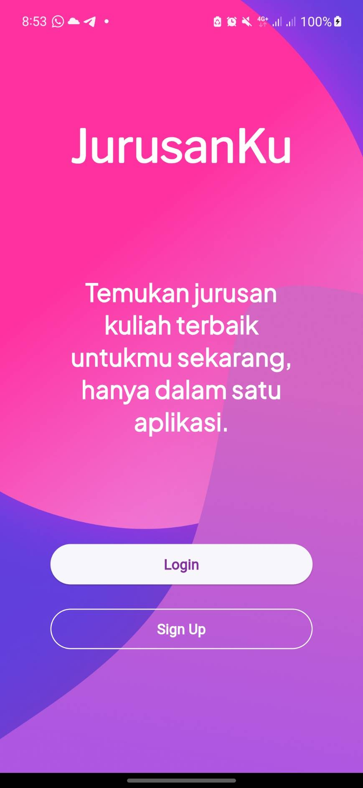
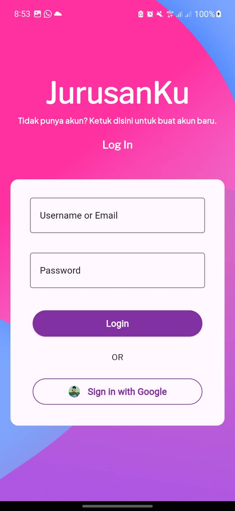
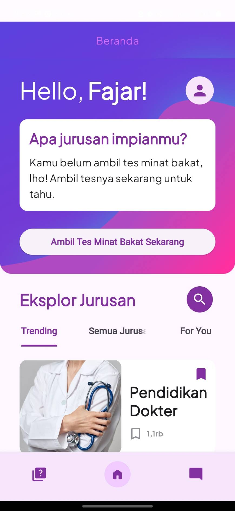
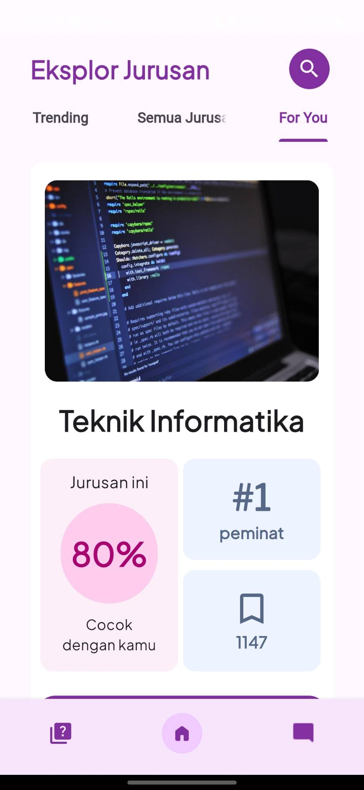
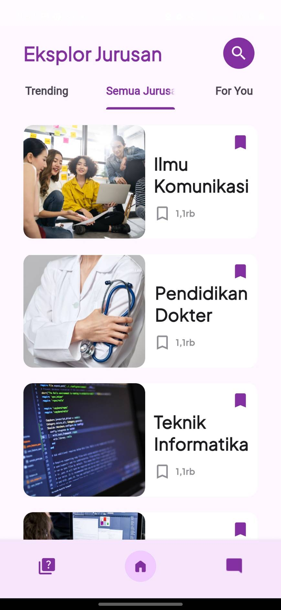
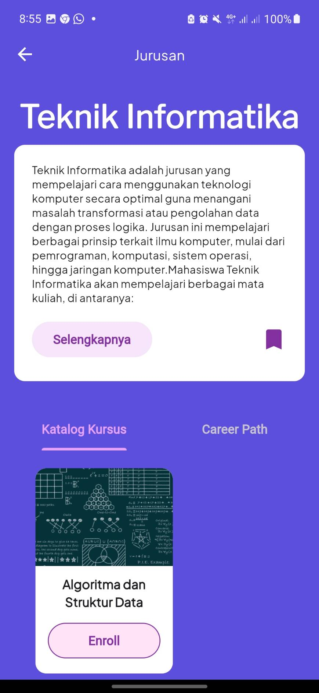
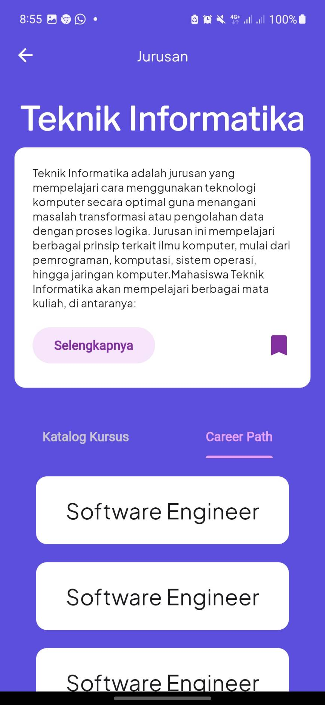

<h2 align="center">
  client-side JurusanKu 
</h2>

> part of Rakuten Team (Hackfest 2024)

 
  
  

## Table of Contents
- [Table of Contents](#table-of-contents)
- [General Information](#general-information)
- [Member List](#member-list)
- [Technologies Used](#technologies-used)
- [Documentation](#documentation)
- [Project Status](#project-status)
- 

## General Information
The system to be developed is a simulation and recommendation system for Indonesian students, specifically designed to be disability-friendly, with the aim of assisting individuals with disabilities in choosing their academic majors. The system will offer courses to simulate lectures related to specific majors. It will be capable of displaying top recommendations based on the user's personality, interests, and talents. Additionally, the system will provide an open discussion platform to connect students seeking information about a particular major with current students or professors in that field.  

## Member List

| Nama                  | Email                       |
| --------------------- | --------------------------- |
| Fajar Maulana Herawan | 13521080@std.stei.itb.ac.id |
| Gevyndo Gunawan       | 18221076@std.stei.itb.ac.id |
| Ilmagita Nariswari    | 18221101@std.stei.itb.ac.id |
| Muhammad Rizky Sya'ban| 13521119@std.stei.itb.ac.id |

## Technologies Used
- flutter - version 3.16.7

## Documentation

  </img>

  </img>
  </img>

  </img>
  </img>

  </img>
  </img>

  </img>

## Project Status
Project is: _on development_

## 
<h4 align="center">
  Created by @Rakuten 
  2024
</h4>

